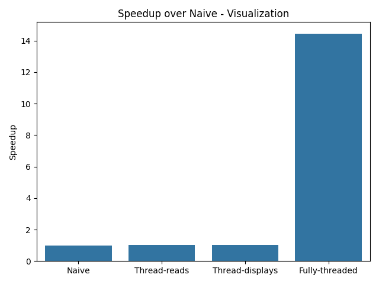

# cv2ext

A collection of tools for making working with OpenCV in Python easier (and potentially faster).

---

## Documentation

https://cv2tools.readthedocs.io/en/latest/

See Also:

https://pypi.org/project/cv2ext/

## Performance

Compared to the naive solution implemented in Python,
by using the tools in cv2ext you can achieve an 8x speedup
on reading and displaying videos.

