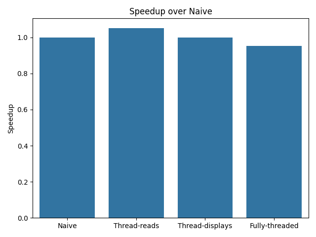
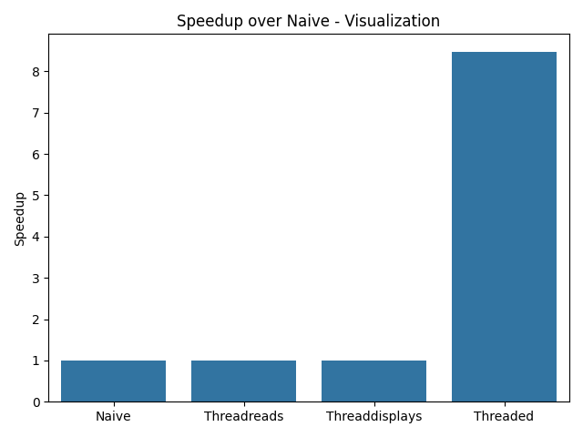

# Benchmarking

cv2ext has builtin threading support to allow potentially faster iterations.
cv2 allows threads to achieve higher fps since the imshow/imread/etc.
do not lock on the global-interpreter-lock (GIL).

Below are the results of said benchmarking.

--------------

As can be seen from the plot showcasing speedup without
and active visualization, there is an overhead cost associated
with using threaded to manage both reading and displaying.
However, when threading both reading and displaying during active 
display we observe that we can achieve an 8x speedup compared
to not using threading.
